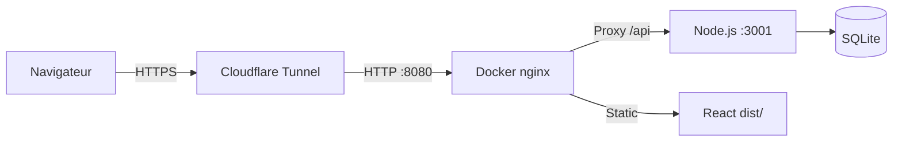

# 🔍 Scan — colo-app (BBOARD)

## Vue d'ensemble

| Attribut | Valeur |
|---|---|
| Nom du projet | **BBOARD** |
| Description | Application d'organisation de colonie de vacances |
| Stack Frontend | React 18 + Vite 5 + TailwindCSS |
| Stack Backend | Node.js + Express + SQLite (via `sqlite3`) |
| Déploiement | Docker (nginx) + Cloudflare Tunnel (`camp.black-i.uk`) |
| Drag & Drop | `@dnd-kit` |
| Icônes | `lucide-react` |

---

## 📁 Structure du projet

```
colo-app/
├── src/
│   ├── App.jsx              # Composant racine + gestion d'état global
│   ├── main.jsx             # Point d'entrée React
│   ├── index.css            # Styles globaux (~11 KB)
│   ├── utils/               # Utilitaires (1 fichier)
│   └── components/
│       ├── SeatMap.jsx      # Plan de salle (drag & drop) — 40 KB ⭐ plus gros fichier
│       ├── ExitSheet.jsx    # Fiche de sortie — 33 KB
│       ├── Schedule.jsx     # Planning — 28 KB
│       ├── Directory.jsx    # Annuaire — 26 KB
│       ├── MeetingRecap.jsx # Récap réunion — 21 KB
│       ├── Sidebar.jsx      # Liste participants (sidebar) — 17 KB
│       ├── Settings.jsx     # Paramètres — 5 KB
│       ├── common/          # 3 composants communs
│       └── directory/       # 7 sous-composants annuaire
├── server/
│   ├── index.js             # API Express (212 lignes)
│   ├── database.sqlite      # Base SQLite (~53 KB, données réelles)
│   ├── package.json         # Dépendances serveur
│   └── check_*.js / test_*.js  # Scripts utilitaires
├── Dockerfile               # Build multi-stage (Node → nginx)
├── docker-compose.yml       # Container unique, port 8080
├── nginx.conf               # Config nginx (SPA)
└── vite.config.js           # Config Vite + proxy /api → :3001
```

---

## 🧭 Navigation / Onglets

L'app expose **6 onglets** (persistés via `localStorage`) :

| ID | Label | Composant | Description |
|---|---|---|---|
| `seatmap` | Plans | [SeatMap.jsx](file:///home/jathur/colo-app/src/components/SeatMap.jsx) | Plan de salle avec drag & drop des participants |
| `schedule` | Planning | [Schedule.jsx](file:///home/jathur/colo-app/src/components/Schedule.jsx) | Calendrier / planning d'activités |
| `exitsheet` | Sortie | [ExitSheet.jsx](file:///home/jathur/colo-app/src/components/ExitSheet.jsx) | Fiche de sortie (autorisations, enfants) |
| `recap` | Récap | [MeetingRecap.jsx](file:///home/jathur/colo-app/src/components/MeetingRecap.jsx) | Compte-rendu de réunion |
| `directory` | Annuaire | [Directory.jsx](file:///home/jathur/colo-app/src/components/Directory.jsx) | Répertoire des participants |
| `settings` | Paramètres | [Settings.jsx](file:///home/jathur/colo-app/src/components/Settings.jsx) | Import/Export, reset données |

---

## 🔌 Backend API (Express — port 3001)

| Route | Méthode | Description |
|---|---|---|
| `/api/participants` | GET / POST | Liste et sauvegarde des participants |
| `/api/groups` | GET / POST | Groupes |
| `/api/activities` | GET / POST | Activités du planning |
| `/api/state/:key` | GET / POST | État générique (ex: `savedViews`, `currentViewName`) |
| `/api/exit-sheets` | GET / POST | Fiches de sortie |
| `/api/exit-sheets/:id` | DELETE | Suppression d'une fiche |

**Base de données SQLite** — 5 tables :
- `participants`, `groups`, `activities` → données JSON sérialisées
- `app_state` → clé/valeur générique
- `exit_sheets` → avec `created_at`

---

## 🔄 Synchronisation données

L'app utilise une **double persistance** :
1. **`localStorage`** — accès instantané, fallback offline
2. **Backend SQLite** — synchronisation toutes les **5 secondes** (polling), avec migration automatique des données locales vers le serveur au premier chargement

> [!NOTE]
> Le `isInitialLoad` ref évite les écritures backend pendant le chargement initial, mais la logique de sync est sensible aux conditions de course (race conditions) si plusieurs onglets/utilisateurs écrivent simultanément.

---

## 📦 Déploiement



- Le frontend est **buildé dans le container Docker** avec nginx
- Le proxy `/api` dans [vite.config.js](file:///home/jathur/colo-app/vite.config.js) est uniquement pour le **dev local**
- En production Docker, nginx doit gérer le proxy vers le backend

> [!WARNING]
> Le [docker-compose.yml](file:///home/jathur/colo-app/docker-compose.yml) ne démarre que le container frontend/nginx. **Le serveur Node.js (port 3001) n'est pas inclus** dans le compose ! Il doit tourner séparément sur l'hôte.

---

## 📊 Taille des composants

| Fichier | Taille | Complexité estimée |
|---|---|---|
| [SeatMap.jsx](file:///home/jathur/colo-app/src/components/SeatMap.jsx) | 40 KB | ⭐⭐⭐⭐⭐ Très complexe |
| [ExitSheet.jsx](file:///home/jathur/colo-app/src/components/ExitSheet.jsx) | 33 KB | ⭐⭐⭐⭐ |
| [Schedule.jsx](file:///home/jathur/colo-app/src/components/Schedule.jsx) | 28 KB | ⭐⭐⭐⭐ |
| [Directory.jsx](file:///home/jathur/colo-app/src/components/Directory.jsx) | 26 KB | ⭐⭐⭐ |
| [MeetingRecap.jsx](file:///home/jathur/colo-app/src/components/MeetingRecap.jsx) | 21 KB | ⭐⭐⭐ |
| [Sidebar.jsx](file:///home/jathur/colo-app/src/components/Sidebar.jsx) | 17 KB | ⭐⭐ |
| [Settings.jsx](file:///home/jathur/colo-app/src/components/Settings.jsx) | 5 KB | ⭐ |

---

## 🧩 Points d'attention / Pistes d'amélioration

| # | Observation | Priorité |
|---|---|---|
| 1 | **Backend manquant dans docker-compose** — le serveur Node.js n'est pas containerisé | 🔴 Haute |
| 2 | **Polling toutes les 5s** — pas optimal pour la collab temps réel (WebSockets serait mieux) | 🟡 Moyenne |
| 3 | **Composants très lourds** — [SeatMap.jsx](file:///home/jathur/colo-app/src/components/SeatMap.jsx) à 40 KB pourrait être découpé | 🟡 Moyenne |
| 4 | **Données JSON sérialisées en DB** — pas de requêtes SQL riches possible | 🟡 Moyenne |
| 5 | **Pas de tests** — aucun fichier de test unitaire/intégration | 🟡 Moyenne |
| 6 | **CORS ouvert** (`app.use(cors())`) sans restriction d'origine | 🟠 À surveiller |
| 7 | **Inline styles dans App.jsx** — media queries en `<style>` inline, à externaliser | 🟢 Faible |
